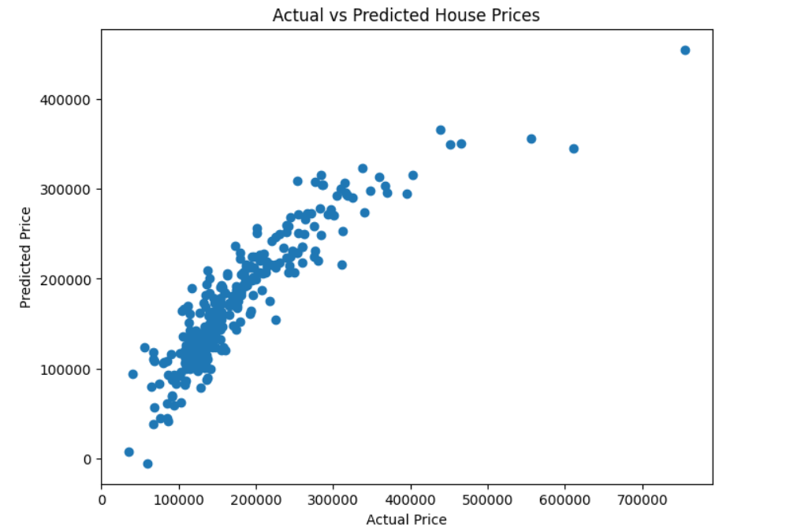

# House-Price-Prediction-ML
House Price Prediction using Machine Learning and Kaggle Dataset
# House Price Prediction Using Machine Learning

## Overview

This project predicts residential house prices using Machine Learning techniques and the Kaggle House Prices dataset.

## Dataset

* Source: Kaggle House Prices Dataset
* Records: 1460
* Features: 81
* Target Variable: SalePrice

## Technologies Used

* Python
* Pandas
* NumPy
* Matplotlib
* Seaborn
* Scikit-Learn
* Google Colab

## Model

Linear Regression

## Results

* MAE: 25,284.81
* RMSE: 39,979.43
* R² Score: 0.7916

## Key Features

* OverallQual
* GrLivArea
* GarageCars
* GarageArea
* TotalBsmtSF

## Conclusion

The model explains approximately 79.16% of the variation in house prices and demonstrates the effectiveness of machine learning for real estate price prediction.

## Visualizations

### Sale Price Distribution

### Correlation Heatmap

### Actual vs Predicted House Prices

